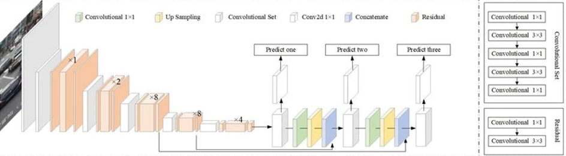
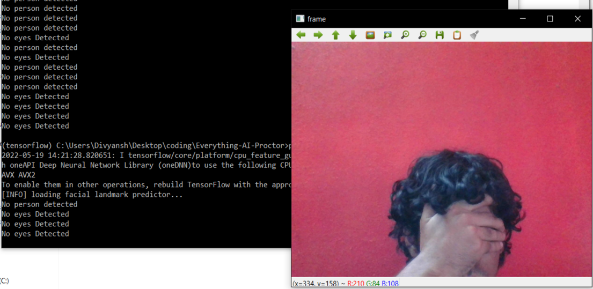
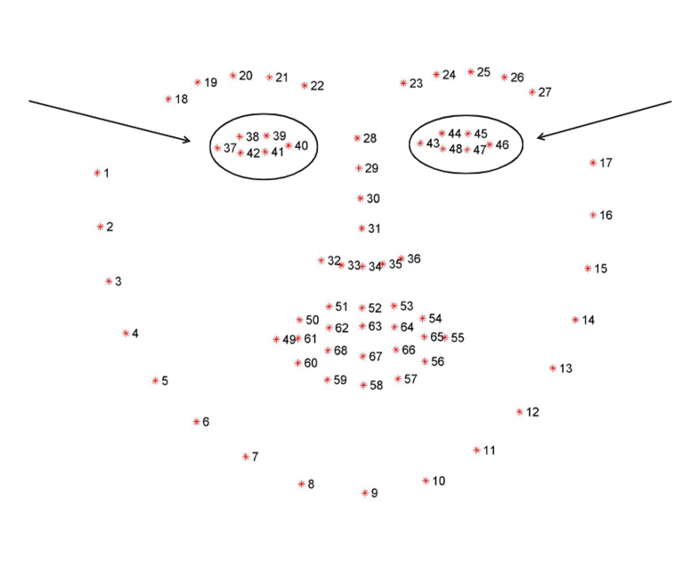
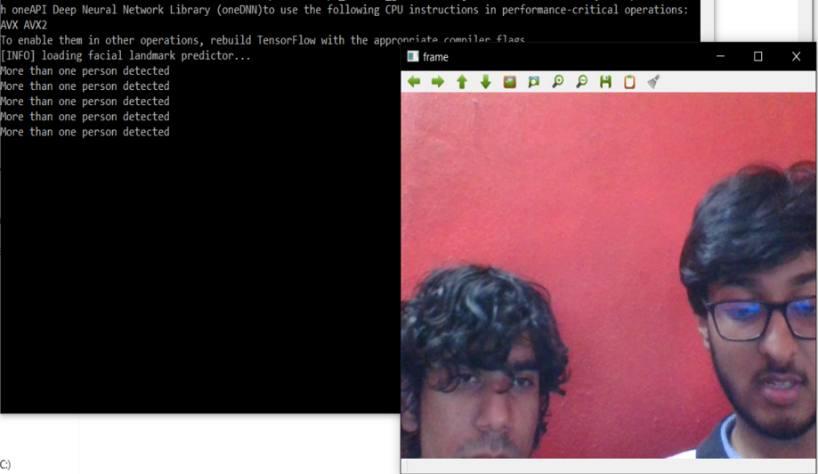
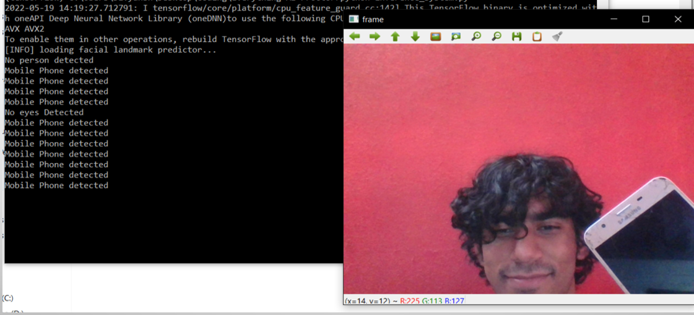
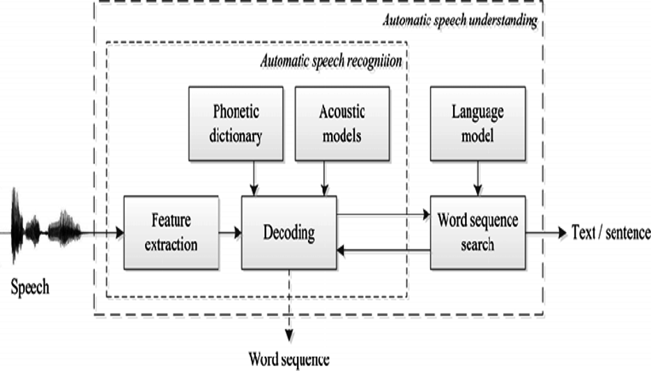

AI Proctoring System (AIPS) is a smart, AI-powered solution designed to maintain academic integrity in online examinations. It leverages computer vision and audio analysis to monitor students during exams, automatically detecting suspicious behaviors and reducing the need for human invigilators.

# 📌 Features
## 🎥 Real-time Video Monitoring
Detects eye movement, face orientation, and the presence of multiple people using webcam footage.

## 🔊 Audio Monitoring
Uses microphone input to detect and flag suspicious sounds or unauthorized speech.

## 🤖 AI & Machine Learning Integration
Employs OpenCV, Dlib, YOLOv3, and Google Speech Recognition API for intelligent detection.

## Vision

1. If the person is looking left, right, up or down, it will track eyes and report.
2. Checks if the candidate is opening his mouth using mouth_opening_detector.py
3.Find instances of Mobile phones.
4. Reports if no or more than one person is detected.
5. Face spoof detection

## Eye tracking-

## More than one person-

## Mobile phone detected-

## Audio audio_part.py
1. Audio from microphone is recorded and converted into text using Google's Speech recognition API.
2. NLTK removes stopwords from the file.
3. Finally, common words along with its numbers are presented to the proctor.

## 💻 Technologies Used
Python

OpenCV

Dlib

YOLOv3 (You Only Look Once)

Google Speech Recognition API

MySQL (for data storage)

🛠 System Architecture
Video Input from webcam is processed via OpenCV and Dlib for facial recognition, eye tracking, and movement analysis.

Audio Input is monitored through the microphone and analyzed using speech recognition techniques.

YOLOv3 is used for object detection — e.g., identifying mobile phones, extra people, or other unauthorized items.

## Flagging Mechanism logs activities such as:

No face detected

Multiple faces detected

Eyes not on screen

Audio disturbances
